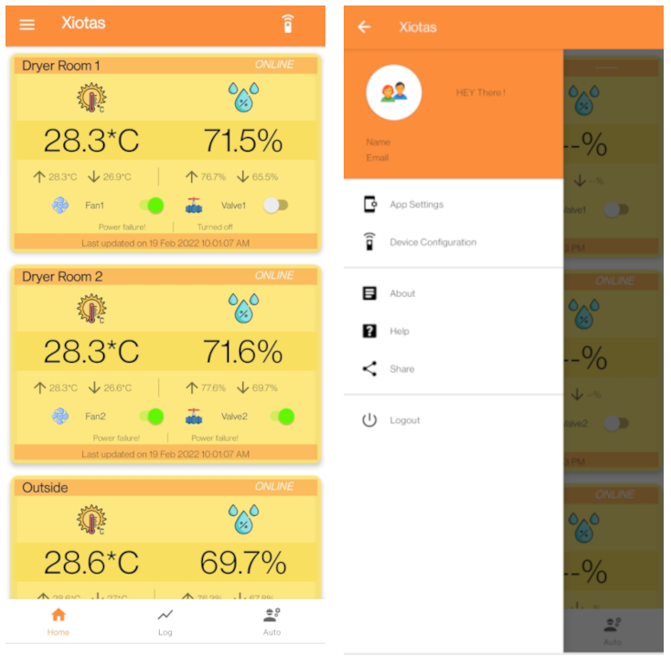
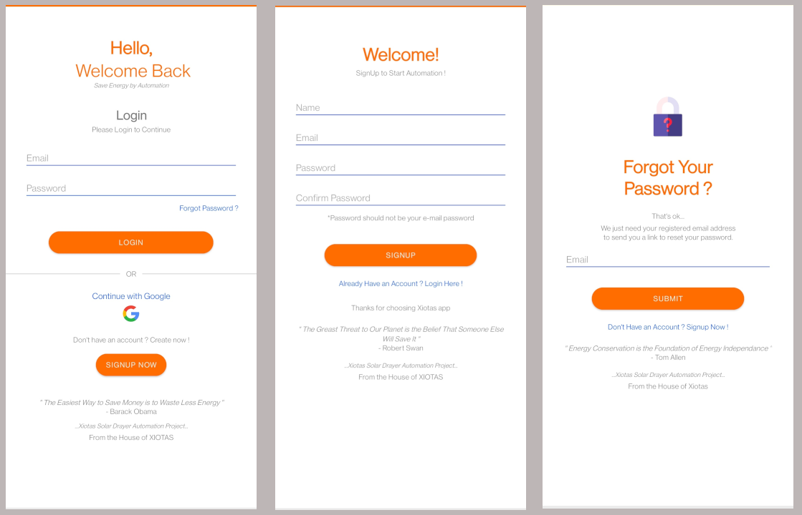

# automated-solar-dryer-controller-android-app
It is an android app for accessing the automated solar dryer controller via internet. It is the app for the previous project named [automated-solar-dryer-controller-esp32](https://github.com/Yadukrishnan-KM/automated-solar-dryer-controller-esp32). It makes the user interface super easy and allowing user for realtime monitoring dryer envionment conditions (temperature and humidity), realtime control of dryer room equipments and check its status.

## App Different Screens
I am adding the different screens of the made Android app. The give below is the main app page which will show when we are opening the app. It contain all the details about each dryer room. These are real time data and contains a time stamp for finding the last updated time. It will help user to about the last updation. From the same window user can controll the devices using the toggle button. It will prompt a dialog box to confirm the operation. Also contain side bar menu for doing different menu settings. It is uder development. Then contain a bottom drawer to switch between different tabs to navigate to different windows. These also under construction. 

The given below is the starting window to go through the user sign-in and account generation process.

The given below is the splash screen to make a small animation in the starting time. Means the screen showing at the time of app loading. It is just to improve user experiance.

